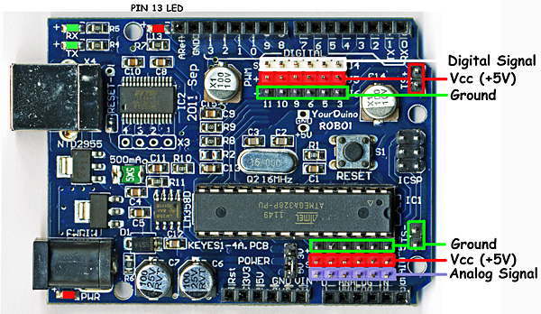

# Placa Arduino

El modelo de la placa es un clon de la Duemilanove original. Fabricado por Funduino. En la siguiente imágen se pueden ver los pines disponibles para conexión.

* La placa acepta alimentación, en el conector a la par del puerto USB, entre 5V y 12V
* A la par de la hilera de conectores digitales se observa unos cabezales preparados con Vcc, masa y señal para los pines que pueden controlar PWM. (Pines 3,5,6,9,10 y 11)
* A la par de la hilera de conectores analógicos se observa unos cabezales preparados con Vcc, masa y señal analógicas para los puertos analógicos.
* A la par de los conectores GND y VIN, en la hilera de conectores analógicos hay un Jumper para seleccionar el voltaje de la lógica de salida: 5V o 3.3V

## Consideraciones para nuestro diseño

* Vamos a utilizar dos motores de corriente contínua como la fuerza motriz de nuestro coche. Por lo tanto, necesitamos dos pines que puedan controlar PWM para manejar la velocidad de los motores.
* Adicionalmente, vamos a utilizar el driver L298N par dar potencia a los motores. Este driver, además del control PWM, requiere dos pines digitales para controlar el sentido de marcha del motor. En total, son necesarios 6 pines digitales para controlar ambos motores.
* Vamos a utilizar un cabezal ultrasónico para medir distancias. Este cabezal requiere ????
* vamos a utilizar un servo motor para poder girar el cabezal en busqueda de obstaculos. El servo requiere de 1 (uno) pin digital para su control
* Vamos a utilizar un seguidor de línea negra para realizar ciertos recorridos. El seguidor requiere de ???
* Vamos a utilizar un módulo de comunicaciones Bluetooth para el control inalámbrico del vehículo. Este módulo requiere de 2 pines digitales para las comunicaciones.